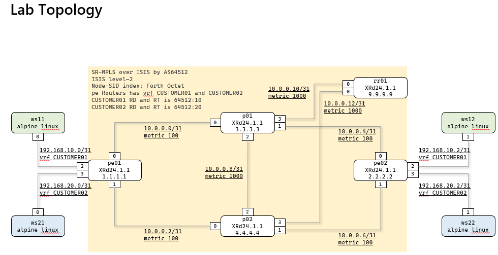
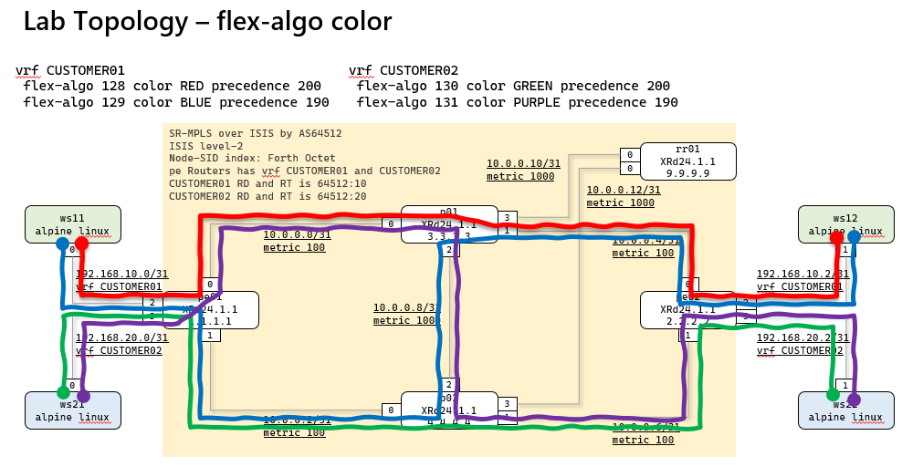

# SR-MPLS flex-algo

## topology


## flex-algo topology


## flex-algo status
```
RP/0/RP0/CPU0:pe01#show isis database verbose | utility egrep "^p|^r|Prefix-SID"
Sat May  9 10:28:10.760 JST
pe01.00-00          * 0x00000007   0xe909        536  /*            0/0/0
    Prefix-SID Index: 1, Algorithm:0, R:0 N:1 P:0 E:0 V:0 L:0
    Prefix-SID Index: 1101, Algorithm:128, R:0 N:1 P:0 E:0 V:0 L:0
    Prefix-SID Index: 1111, Algorithm:129, R:0 N:1 P:0 E:0 V:0 L:0
    Prefix-SID Index: 1201, Algorithm:130, R:0 N:1 P:0 E:0 V:0 L:0
    Prefix-SID Index: 1211, Algorithm:131, R:0 N:1 P:0 E:0 V:0 L:0
pe02.00-00            0x00000007   0xa912        531  /1200         0/0/0
    Prefix-SID Index: 2, Algorithm:0, R:0 N:1 P:0 E:0 V:0 L:0
    Prefix-SID Index: 1102, Algorithm:128, R:0 N:1 P:0 E:0 V:0 L:0
    Prefix-SID Index: 1112, Algorithm:129, R:0 N:1 P:0 E:0 V:0 L:0
    Prefix-SID Index: 1202, Algorithm:130, R:0 N:1 P:0 E:0 V:0 L:0
    Prefix-SID Index: 1212, Algorithm:131, R:0 N:1 P:0 E:0 V:0 L:0
p01.00-00             0x00000008   0x9267        536  /1200         0/0/0
    Prefix-SID Index: 3, Algorithm:0, R:0 N:1 P:0 E:0 V:0 L:0
    Prefix-SID Index: 1103, Algorithm:128, R:0 N:1 P:0 E:0 V:0 L:0
    Prefix-SID Index: 1113, Algorithm:129, R:0 N:1 P:0 E:0 V:0 L:0
    Prefix-SID Index: 1203, Algorithm:130, R:0 N:1 P:0 E:0 V:0 L:0
    Prefix-SID Index: 1213, Algorithm:131, R:0 N:1 P:0 E:0 V:0 L:0
p02.00-00             0x00000008   0xa1ab        538  /1200         0/0/0
    Prefix-SID Index: 4, Algorithm:0, R:0 N:1 P:0 E:0 V:0 L:0
    Prefix-SID Index: 1104, Algorithm:128, R:0 N:1 P:0 E:0 V:0 L:0
    Prefix-SID Index: 1114, Algorithm:129, R:0 N:1 P:0 E:0 V:0 L:0
    Prefix-SID Index: 1204, Algorithm:130, R:0 N:1 P:0 E:0 V:0 L:0
    Prefix-SID Index: 1214, Algorithm:131, R:0 N:1 P:0 E:0 V:0 L:0
rr01.00-00            0x00000007   0x392d        531  /1200         0/0/0
    Prefix-SID Index: 9, Algorithm:0, R:0 N:1 P:0 E:0 V:0 L:0
RP/0/RP0/CPU0:pe01#

RP/0/RP0/CPU0:pe01#show segment-routing traffic-eng policy color 10 | utility egrep "Preference|Attributes|Prefix-SID|Binding SID"
Sat May  9 10:27:35.314 JST
    Preference: 200 (configuration) (active)
        Prefix-SID Algorithm: 128
          SID[0]: 17102 [Prefix-SID: 2.2.2.2, Algorithm: 128]
    Preference: 190 (configuration) (inactive)
        Prefix-SID Algorithm: 129
    Preference: 100 (configuration) (inactive)
        Prefix-SID Algorithm: 0
  Attributes:
    Binding SID: 24008
RP/0/RP0/CPU0:pe01#

/ # hostname
ws11
/ # traceroute 192.168.10.3
traceroute to 192.168.10.3 (192.168.10.3), 30 hops max, 46 byte packets
 1  192.168.10.0 (192.168.10.0)  3.348 ms  1.439 ms  0.996 ms
 2  10.0.0.1 (10.0.0.1)  5.182 ms  4.646 ms  4.606 ms
 3  10.0.0.4 (10.0.0.4)  5.523 ms  5.431 ms  3.978 ms
 4  192.168.10.3 (192.168.10.3)  6.189 ms  4.721 ms  3.412 ms
/ #

```

## pe01 Gi0/0/0/0 shutdown
```
RP/0/RP0/CPU0:pe01(config)#inter gigabitEthernet 0/0/0/0
RP/0/RP0/CPU0:pe01(config-if)#shut
RP/0/RP0/CPU0:pe01(config-if)#commit
Sat May  9 10:35:07.930 JST
RP/0/RP0/CPU0:2026 May  9 10:35:08.005 JST: ifmgr[333]: %PKT_INFRA-LINK-5-CHANGED : Interface GigabitEthernet0/0/0/0, changed state to Administratively Down
RP/0/RP0/CPU0:2026 May  9 10:35:08.006 JST: isis[1003]: %ROUTING-ISIS-5-ADJCHANGE : ISIS (MAIN): Adjacency to p01 (GigabitEthernet0/0/0/0) (L2) Down, Interface state down
RP/0/RP0/CPU0:2026 May  9 10:35:08.073 JST: config[65539]: %MGBL-CONFIG-6-DB_COMMIT : Configuration committed by user 'clab'. Use 'show configuration commit changes 1000000059' to view the changes.
RP/0/RP0/CPU0:pe01(config-if)#do show segment-routing traffic-eng policy color 10 | utility egrep "Preference|Attribut$
Sat May  9 10:35:29.366 JST
    Preference: 200 (configuration) (inactive)
        Prefix-SID Algorithm: 128
    Preference: 190 (configuration) (active)
        Prefix-SID Algorithm: 129
          SID[0]: 17112 [Prefix-SID: 2.2.2.2, Algorithm: 129]
    Preference: 100 (configuration) (inactive)
        Prefix-SID Algorithm: 0
  Attributes:
    Binding SID: 24008
RP/0/RP0/CPU0:pe01(config-if)#

/ # traceroute 192.168.10.3
traceroute to 192.168.10.3 (192.168.10.3), 30 hops max, 46 byte packets
 1  192.168.10.0 (192.168.10.0)  1.634 ms  1.293 ms  1.196 ms
 2  10.0.0.3 (10.0.0.3)  5.497 ms  5.530 ms  5.228 ms
 3  10.0.0.8 (10.0.0.8)  4.579 ms  4.640 ms  4.646 ms
 4  10.0.0.4 (10.0.0.4)  3.853 ms  5.303 ms  4.755 ms
 5  192.168.10.3 (192.168.10.3)  5.008 ms  4.502 ms  4.371 ms
/ #
```

## p01 Gi0/0/0/2 shutdown
```
RP/0/RP0/CPU0:p01(config)#inter gigabitEthernet 0/0/0/2
RP/0/RP0/CPU0:p01(config-if)#shut
RP/0/RP0/CPU0:p01(config-if)#commit
Sat May  9 10:37:04.830 JST
RP/0/RP0/CPU0:2026 May  9 10:37:04.901 JST: ifmgr[333]: %PKT_INFRA-LINK-5-CHANGED : Interface GigabitEthernet0/0/0/2, changed state to Administratively Down
RP/0/RP0/CPU0:2026 May  9 10:37:04.902 JST: isis[1003]: %ROUTING-ISIS-5-ADJCHANGE : ISIS (MAIN): Adjacency to p02 (GigabitEthernet0/0/0/2) (L2) Down, Interface state down
RP/0/RP0/CPU0:2026 May  9 10:37:04.971 JST: config[69117]: %MGBL-CONFIG-6-DB_COMMIT : Configuration committed by user 'clab'. Use 'show configuration commit changes 1000000035' to view the changes.
RP/0/RP0/CPU0:p01(config-if)#

RP/0/RP0/CPU0:pe01#show segment-routing traffic-eng policy color 10 | utility egrep "Preference|Attributes|Prefix-SID|$
Sat May  9 10:37:43.935 JST
    Preference: 200 (configuration) (inactive)
        Prefix-SID Algorithm: 128
    Preference: 190 (configuration) (inactive)
        Prefix-SID Algorithm: 129
    Preference: 100 (configuration) (active)
        Prefix-SID Algorithm: 0
          SID[0]: 16002 [Prefix-SID, 2.2.2.2]
  Attributes:
    Binding SID: 24008
RP/0/RP0/CPU0:pe01#

/ # traceroute 192.168.10.3
traceroute to 192.168.10.3 (192.168.10.3), 30 hops max, 46 byte packets
 1  192.168.10.0 (192.168.10.0)  1.402 ms  1.153 ms  0.814 ms
 2  10.0.0.3 (10.0.0.3)  3.911 ms  4.342 ms  4.157 ms
 3  10.0.0.6 (10.0.0.6)  5.165 ms  5.296 ms  5.737 ms
 4  192.168.10.3 (192.168.10.3)  5.979 ms  5.035 ms  5.929 ms
/ #
```
